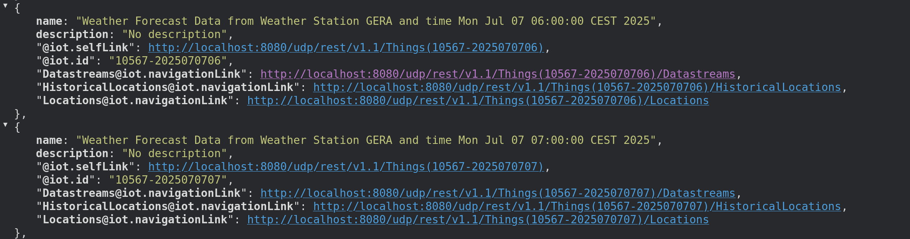
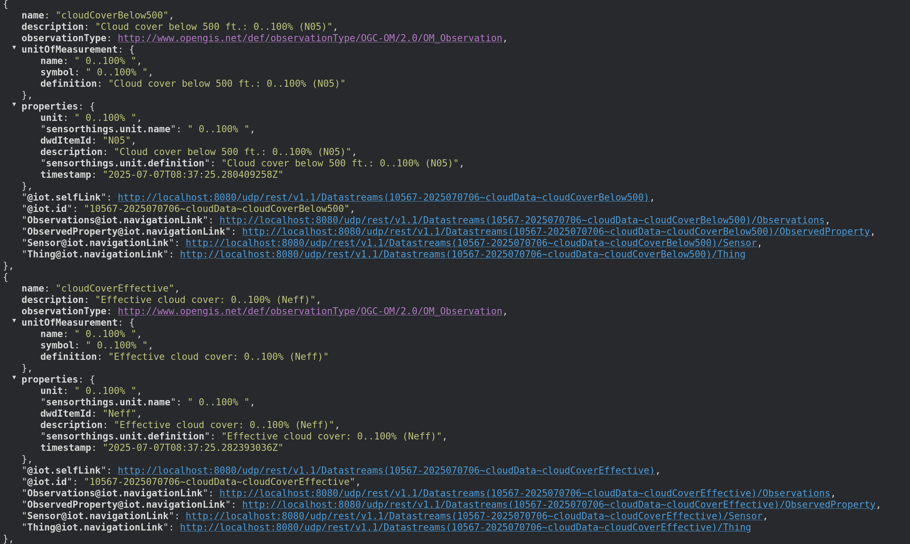

# UDP Sensinact Weather Adapter

This is the sensinact adapter for the weather info obtained from [DWD](https://www.dwd.de/DE/Home/home_node.html).

## The Models

We have modeled the `MOSMIXWeatherReport` from [here](https://github.com/geckoprojects-org/org.gecko.weather/blob/snapshot/org.gecko.weather.model/model/dwd-weather.ecore) into the corresponding sensinact model, located under `org.eclipse.fennec.weather.sensinact.model`.

The `MOSMIXWeatherReport` is, in sensinact terms, a `Provider`. The different data topologies (e.g. precipitation data, wind data, etc.) have been grouped into corresponding `Service`. 

## Runtime Config

We configured a `MOSMIXStation` to get the data from, like 

```json
"DWD-MOSMIX-Station~Gera": {
		"stationId": "10567",
		"name": "Gera-Leumnitz",
		"latitude": "50.88",
		"longitude": "12.13"
	}
```

This is the DWD weather station closest to Jena. 

The weather data is collected from this station hourly and at reboot of the application. 

The results are a forecast weather report, which is available hourly for the 10 days subsequent the time of the request.

## Results

The results, once the application is up and running, look like this in sensinact:



and, following the corresponding `DataStreams` link, among all the other resources, one should see something like:




